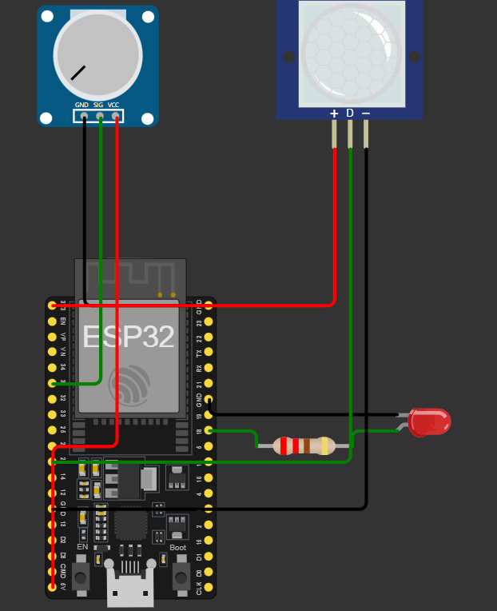
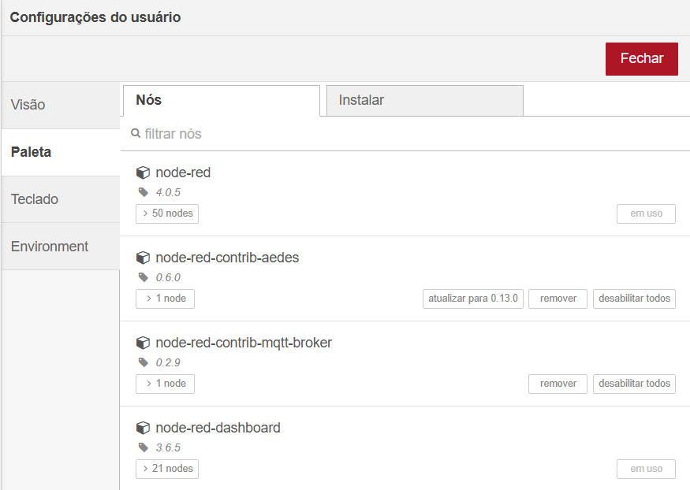

# Global Solution - Energy Saver

### Descrição do projeto:  

- O EnergySave é um sistema revolucionário de monitoramento de energia para iluminação pública que visa promover eficiência e sustentabilidade ambiental urbana. Através da integração de sensores IoT e uma API REST em Java, o sistema coleta e analisa em tempo real informações referentes ao consumo dos postes, resultando na redução do desperdício energético e na facilitação do planeamento da manutenção. Por meio de um aplicativo móvel dedicado, as autoridades podem visualizar dados atualizados instantaneamente, receber alertas sobre usos anómalos da energia e consultar relatórios minuciosos para uma gestão mais inteligente e sustentável no âmbito da iluminação urbana.
 

### Detecção de movimento com ESP32 e Node-RED

- Link do vídeo no Youtube:
- Link do projeto no Wokwi: <a href="https://wokwi.com/projects/415226947604233217">Wokwi</a>
 

Este projeto utiliza ESP32 conectado a um sensor de movimento e a um potenciômetro para detectar movimentações, simulando a presença de uma pessoa na rua por exemplo, Os dados são enviados para um broker MQTT e visualizados no Node-RED.

### 🚀 Funcionalidades

- Detecção de movimento por meio do sensor de movimento.
- Publicação de dados via protocolo MQTT.
- Visualização no Node-RED, incluindo gráficos.

### Componentes Necessários
- ESP32
- Potenciômetro
- Sensor de movimento
- Resistor
- LED

### Resultado Esperado

Ao pressionar o botão "Simulate Motion" do PIR Motion Sensor, o LED que está utilizando 60% da sua potência de iluminação, passará a utilizar 100% da sua potência, uma vez que o sensor já detectou uma presença naquele determinado momento.

### 📌 Configuração do Node-RED

O fluxo do Node-RED está exportado no arquivo <a href="config_node_red.json/">Config</a>

#### Instalar extensão:

- Abra o Node-RED.
- Clique no menu no canto superior direito (três linhas horizontais) e selecione Settings.
- No canto esquerdo da aba que ira abrir (User Settings) selecione Palette.
- Clique em Install e baixe as seguintes extensoes.

### Como importar:

- Abra o Node-RED.
- Clique no menu no canto superior direito (três linhas horizontais) e selecione Importar.
- Carregue o arquivo node_red_config.json.
- Configure os tópicos MQTT e o broker

Após importar, o fluxo estará pronto, incluindo gráficos e medidores de temperatura e umidade.

### Integrantes
- Guilherme Rocha Toledo dos Santos - RM99396
   
  
- Gustavo Nunes Pereira - RM551496
   
  
- Isadora Tatajuba Moreira Pinto - RM552522
   
   
- Maria Eduarda Sousa de Oliveira - RM552477
   
  
- Matheus Wasserman Fernandes Silva - RM550712
   
